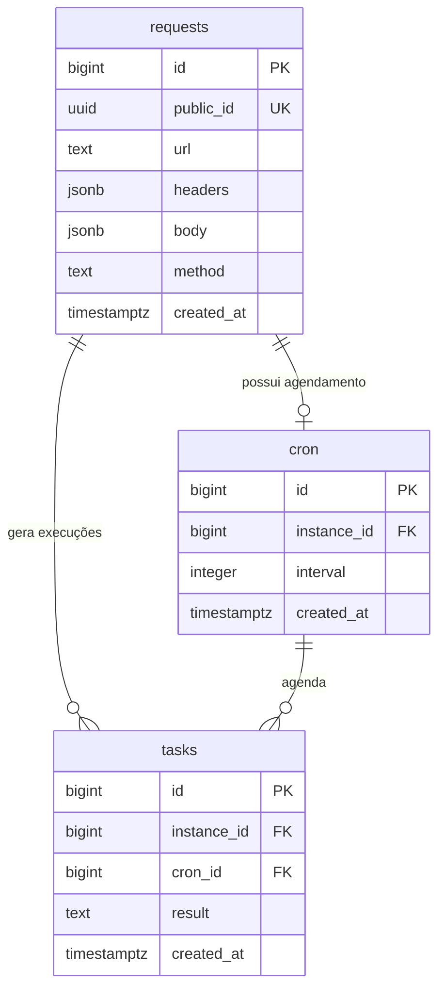

# Schema do Banco de Dados

Estrutura inicial das tabelas responsáveis por armazenar as requisições HTTP, seus agendamentos e o histórico de execuções.

## Diagrama de relacionamento

## Tabelas

### `requests`

Armazena a configuração da requisição HTTP cadastrada pelo usuário.

| Coluna | Tipo | Restrição | Descrição |
| --- | --- | --- | --- |
| `id` | `BIGINT` | Chave primária | Identificador interno da requisição. |
| `public_id` | `UUID` | Único | Identificador público usado para consultar a requisição. |
| `url` | `TEXT` | — | URL de destino. |
| `headers` | `JSONB` | Obrigatório | Cabeçalhos enviados na requisição. |
| `body` | `JSONB` | Obrigatório | Corpo da requisição. |
| `method` | `TEXT` | — | Método HTTP utilizado. |
| `created_at` | `TIMESTAMPTZ` | — | Data e hora de criação do registro. |

### `cron`

Armazena a configuração de agendamento de cada requisição.

| Coluna | Tipo | Restrição | Descrição |
| --- | --- | --- | --- |
| `id` | `BIGINT` | Chave primária | Identificador interno do agendamento. |
| `instance_id` | `BIGINT` | Chave estrangeira | Referência a `requests.id`. |
| `interval` | `INTEGER` | — | Intervalo entre as execuções. |
| `created_at` | `TIMESTAMPTZ` | — | Data e hora de criação do agendamento. |

### `tasks`

Armazena o histórico das execuções realizadas.

| Coluna | Tipo | Restrição | Descrição |
| --- | --- | --- | --- |
| `id` | `BIGINT` | Chave primária | Identificador interno da execução. |
| `instance_id` | `BIGINT` | Chave estrangeira | Referência a `requests.id`. |
| `cron_id` | `BIGINT` | Chave estrangeira | Referência a `cron.id`. |
| `result` | `TEXT` | — | Resultado ou mensagem de erro da execução. |
| `created_at` | `TIMESTAMPTZ` | — | Data e hora em que a execução foi registrada. |

## Relacionamentos

| Origem | Destino | Relacionamento |
| --- | --- | --- |
| `cron.instance_id` | `requests.id` | Um agendamento pertence a uma requisição. |
| `tasks.instance_id` | `requests.id` | Uma execução pertence a uma requisição. |
| `tasks.cron_id` | `cron.id` | Uma execução é originada por um agendamento. |

## Legenda

- **PK** — *Primary Key* (chave primária)
- **FK** — *Foreign Key* (chave estrangeira)
- **UK** — *Unique Key* (valor único)

## Pontos a definir

- unidade utilizada por `cron.interval`, como segundos ou minutos;
- campos obrigatórios e campos que aceitam `NULL`;
- valor padrão de `created_at`;
- comportamento das relações ao excluir uma requisição ou um agendamento;
- armazenamento separado do status HTTP, estado da execução e mensagem de erro;
- índices adicionais para as consultas mais frequentes.
