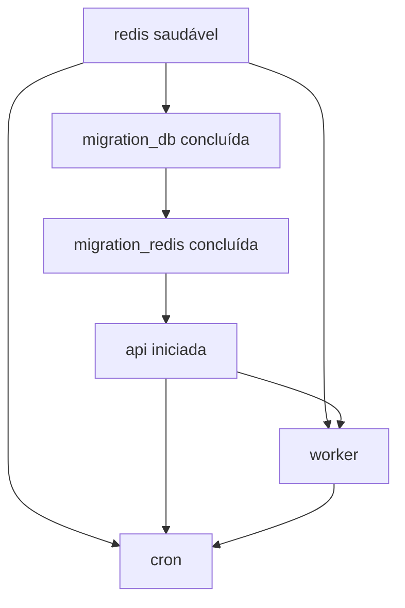

# Camada controller e implantação

## Objetivo

A pasta `src/controller` descreve como empacotar e executar os processos do sistema. Ela não contém controllers HTTP; as rotas ficam na camada de aplicação. Neste projeto, “controller” representa a camada de execução com Docker.

## Estrutura

```text
src/controller/
├── compose.yml
├── Dockerfile.api
├── Dockerfile.cron
├── Dockerfile.worker
└── requirements.txt
```

## Imagens

### API

`Dockerfile.api`:

1. usa `python:3.14.7`;
2. define `/app` como diretório de trabalho;
3. copia `src` para `/app/src`;
4. instala `src/controller/requirements.txt`.

O Dockerfile não possui `CMD`; o comando vem do Compose. A mesma imagem `cron-api:latest` também é reutilizada pelos dois serviços de migração.

### Cron

`Dockerfile.cron` possui a mesma base e dependências, mas define:

```text
python -m src.aplication.main start_cron
```

O contêiner mantém o loop de agendamento ativo.

### Worker

`Dockerfile.worker` inicia:

```text
celery -A src.infra.manage:celery_app worker --loglevel=INFO
```

O argumento `-A` aponta para o objeto Celery criado pela infraestrutura. O worker descobre e registra `execute_task`.

## Serviços do Compose

### `redis`

- imagem oficial `redis:8`;
- porta disponível apenas na rede do Compose;
- healthcheck com `redis-cli ping`;
- sem volume declarado.

Os outros serviços acessam o Redis pelo host `redis` e porta `6379`, não por `localhost`.

### `migration_db`

- usa a imagem da API;
- aguarda Redis saudável;
- carrega o ambiente;
- executa `python -m src.infra.manage migration_db`;
- possui `restart: "no"`;
- deve finalizar com código zero antes da etapa seguinte.

Embora a migração de banco não dependa conceitualmente do Redis, `infra.manage` cria e testa todas as conexões durante a importação, por isso o serviço precisa do Redis disponível.

### `migration_redis`

- aguarda Redis saudável;
- aguarda `migration_db` terminar com sucesso;
- executa `python -m src.infra.manage migration_redis`;
- remove e recria o sorted set de schedule;
- encerra após a sincronização.

### `api`

- aguarda Redis saudável e a migration Redis;
- publica `8000:8000`;
- inicia Uvicorn em `0.0.0.0:8000`;
- expõe `src.aplication.main:app`.

O uso de `0.0.0.0` dentro do contêiner é necessário para aceitar tráfego encaminhado pelo Docker.

### `worker`

- usa `cron-worker:latest`;
- aguarda Redis e o início da API;
- consome mensagens do broker no Redis;
- executa as requisições externas e grava resultados.

### `cron`

- usa `cron-loop:latest`;
- aguarda Redis, API e worker iniciarem;
- lê o schedule e publica tasks;
- não recebe tráfego HTTP.

## Ordem de inicialização



`service_started` confirma que o contêiner começou, mas não garante que a aplicação interna esteja pronta. O Redis possui healthcheck; API e worker não possuem healthchecks próprios atualmente.

## Ambiente e rede

Todos os serviços são colocados automaticamente na rede padrão criada pelo Compose. Nela, o nome do serviço funciona como DNS:

- `redis:6379` acessa Redis;
- outros nomes poderiam ser usados da mesma forma se houvesse comunicação direta.

Não é necessário declarar `networks` enquanto todos os serviços puderem compartilhar a rede padrão. Redes nomeadas passam a ser úteis para isolamento, integração entre múltiplos projetos Compose ou separação de serviços públicos e privados.

O arquivo `.env` é carregado por `env_file`. As entradas `environment` de host e porta do Redis têm precedência e garantem endereçamento correto dentro dos contêineres.

## Persistência

O banco PostgreSQL é externo, então seus dados sobrevivem à recriação do Compose. Redis não tem volume declarado:

- parar e iniciar o mesmo contêiner pode manter os arquivos da camada gravável;
- remover e recriar o contêiner elimina esse estado local;
- a migration Redis deve reconstruir `schedule` usando PostgreSQL.

## Comandos operacionais

Construir e iniciar:

```bash
docker compose -f src/controller/compose.yml up --build
```

Iniciar em segundo plano:

```bash
docker compose -f src/controller/compose.yml up --build -d
```

Ver estado:

```bash
docker compose -f src/controller/compose.yml ps
```

Ver logs:

```bash
docker compose -f src/controller/compose.yml logs -f api cron worker
```

Executar somente a migração Redis novamente:

```bash
docker compose -f src/controller/compose.yml run --rm migration_redis
```

Inspecionar schedule:

```bash
docker compose -f src/controller/compose.yml exec redis redis-cli ZRANGE schedule 0 -1 WITHSCORES
```

Encerrar os serviços:

```bash
docker compose -f src/controller/compose.yml down
```

## Dependências Python

`requirements.txt` fixa versões de FastAPI, Uvicorn, Celery, Redis, SQLAlchemy, psycopg2, Requests, PyJWT, Pydantic e dependências transitivas. As três imagens instalam o mesmo conjunto, favorecendo consistência mas aumentando o tamanho de imagens que não precisam de toda a stack.

## Pontos de atenção

- A tag Python `3.14.7` precisa existir no registry no momento do build.
- Não existem usuário não-root, healthcheck da API, limites de recursos ou políticas de restart para processos longos.
- O build copia toda a pasta `src`; um `.dockerignore` na raiz do contexto controla arquivos enviados ao daemon.
- O PostgreSQL externo deve aceitar conexões originadas do ambiente Docker.
- O segredo JWT e a URL do banco devem permanecer fora da imagem.
